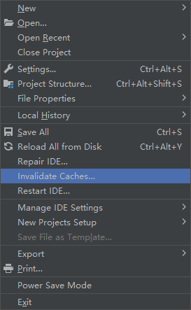

#### 问题背景

Maven项目构建时报错如下

```
[ERROR] Malformed \uxxxx encoding.
[ERROR] java.lang.IllegalArgumentException: Malformed \uxxxx encoding.
[ERROR] 
[ERROR] To see the full stack trace of the errors, re-run Maven with the -e switch.
[ERROR] Re-run Maven using the -X switch to enable full debug logging.
```
<!--more-->

#### 问题根因

maven本地仓库更新策略是会更新三个元文件（包含resolver-status.properties配置文件）以及本地仓库jar包，如果历史文件有错误的话可能会导致加载配置路径错误。

#### 解决方案

All Roads Lead to Rome.

下列所有操作都是修改的IDEA中Maven配置的本地仓库路径。

【方案1】
将Maven仓库Repository中的所有文件resolver-status.properties删除。该方案较为暴力，需要重新下载maven远程仓的jar包。

【方案2】
修改Maven配置中的本地仓库为新仓库路径。该方法的代价是占用更多的磁盘空间，毕竟会下载一些重复的jar包。

【方案3】
输入bash命令找出有问题的文件并删除掉，命令如下，
`grep -lrnw . -e '\u0000' | xargs rm`

记得最后刷新缓存重启IDEA


