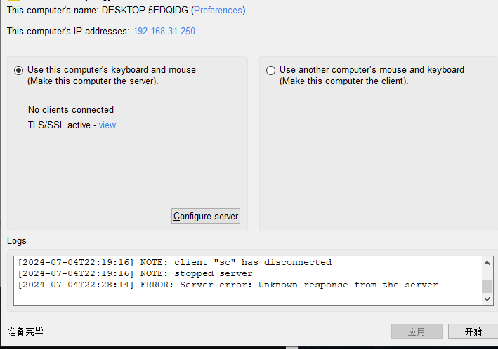
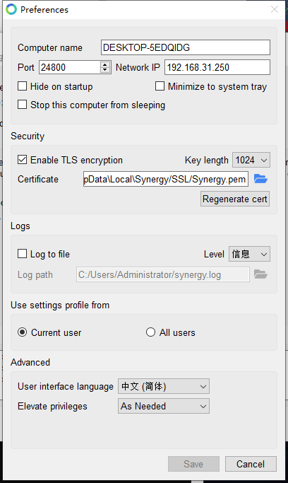
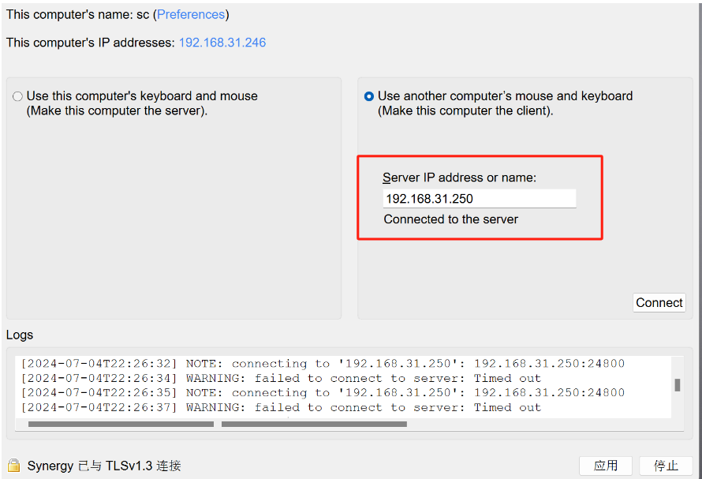
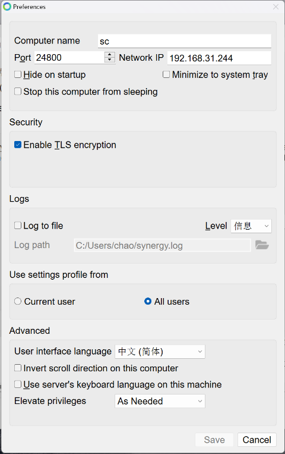
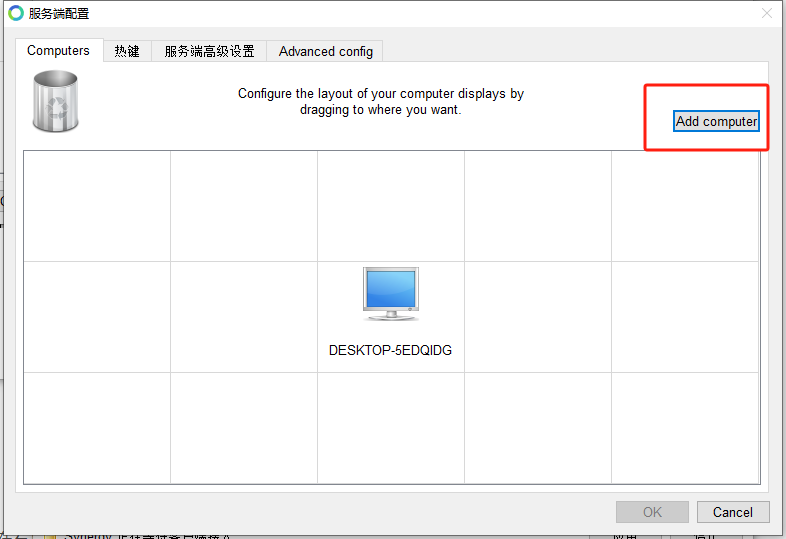
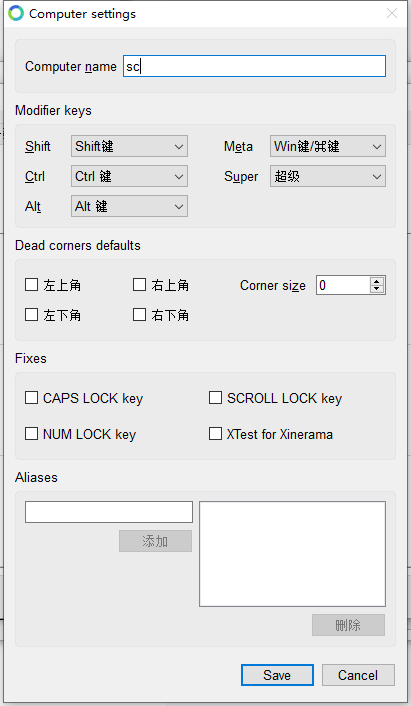
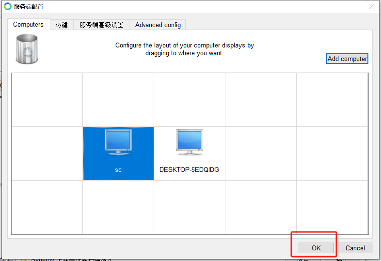
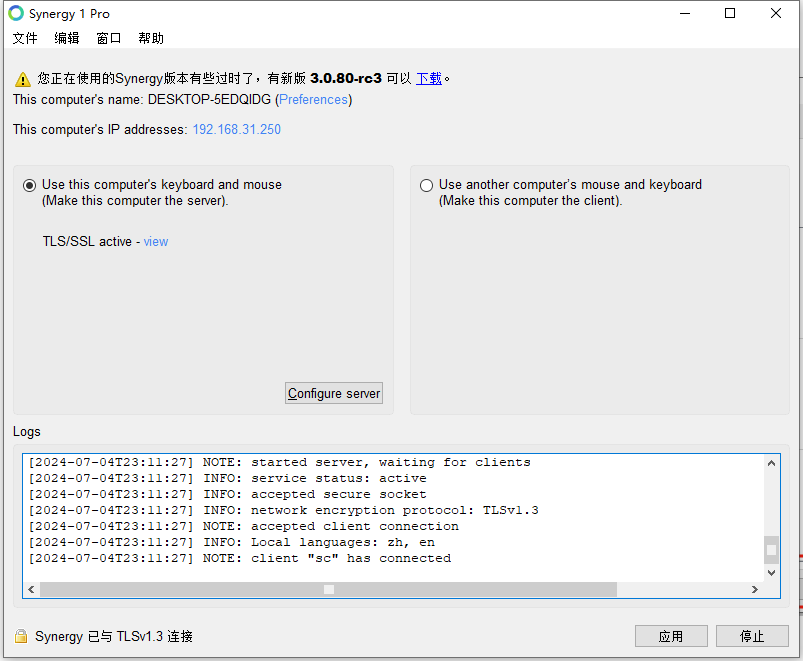

##### Synergy软件的基本配置/使用

1、Synergy软件的简介
Synergy是一款可让多台电脑共享一个鼠标与键盘的软件，用户可借助Synergy操作一个鼠标与键盘控制多个电脑

<!--more-->

[借用大佬Synergy下载地址](https://www.52pojie.cn/thread-1609954-1-1.html)

[蓝奏云网盘](https://kuking.lanzouv.com/iTpI401z43pe)

2、Synergy软件的配置过程

安装过程省略，

**需注意：**

**1.安装路径不要有中文或者特殊字符**。

**2.所有主机都必须连入同一个局域网，会通过局域网交换鼠标键盘的输入信息。**

选择服务端(Server)/客户端(Client)

Server：share this computer’s mouse and keyboard（共享此脑的鼠标和键盘）

Client：use another computer’s mouse and keyboard（使用另一台电脑的键盘和鼠标）

将你要使用的鼠标和键盘所在的电脑设置为服务端（Server），其他电脑设置为客户端（Client）

客户端配置：

在客户端输入服务端的IP地址，必需正确输入才能与接服务端连接

将创建后的电脑进行命名，切记必需要命名为客户端电脑对应的客户端名称。

正确命名后，点击【OK】（其它保持默认）：

布局指明客户机端和服务机端的实际相对位置（当前设置为客户机端在左，服务机端在右）。当然，你也可以把客户机端放在其它位置，但要相对于服务机端放置。

至此，便可实现了多台电脑共享一个鼠标与键盘。
